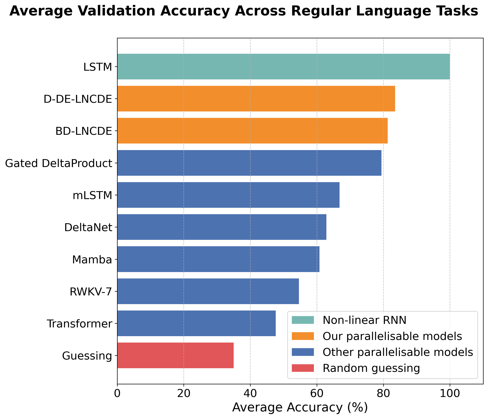

<h1 align="center">Structured Linear Controlled Differential Equations: Maximally Expressive and Parallel-in-Time Sequence Models</h1>
<h2 align="center"><em>Don't be Dense, SLiCE the Cost!</em></h2>

Structured Linear Controlled Differential Equations (SLiCEs) are a new class of sequence models that combine the maximal expressivity (i.e., universality) of dense, input-dependent, state-transition matrices with the computational efficiency of structured alternatives. The SLiCE framework generalises and extends architectures such as DeltaNet (which uses a diagonal-plus-low-rank structure) and input-dependent block-diagonal linear RNNs, alongside introducing two novel variants based on sparsity and the Walsh–Hadamard transform. Unlike S4 and Mamba, which rely on diagonal state-transition matrices, SLiCEs with block-diagonal, sparse, or Walsh–Hadamard structures match the maximal expressivity of dense matrices while being significantly cheaper to compute.

**Highlights:**
- ✅ Maximal expressivity without the cost of dense matrices  
- ⚡ Parallel-in-time computation via associative scans  
- 📉 20× faster per-step training compared to non-linear NCDEs on real-world time-series tasks  
- 🧠 Best-in-class state-tracking performance among parallel models on regular language tasks  

<p align="center">
    
</p>

## Contents

- [Structured Linear Controlled Differential Equations](#structured-linear-controlled-differential-equations)
  - [Linear NCDEs](#linear-ncdes)
  - [LNCDE Variants](#lncde-variants)
- [Using this Repository](#using-this-repository)
- [Environment](#environment)
  - [SLiCEs](#slices)
  - [Flash-linear-attention](#flash-linear-attention)
  - [Mamba](#mamba)
  - [xLSTM](#xlstm)


## Structured Linear Controlled Differential Equations 

### Linear NCDEs

A linear neural controlled differential equation (LNCDE) takes the form

$$
h_t = h_0 + \int_0^t \sum_{i=1}^{d_{\omega}} A^i_{\theta} h_s \mathrm{d}\omega^{X, i}_s,
$$

where:
- $A^i_{\theta} \in \mathbb{R}^{d_h \times d_h}$ are the state-transition matrices for each channel of $\omega$,
- $X$ is a continuous interpolation of the observed input time series,
- $\omega^{X, i}$ is the $i$-th channel of a path derived from $X$.

Common choices for $\omega_t$ include:
- $(t, X_t)$, the time-augmented input, 
- or the integrated path $\int_0^t (s, X_s) \mathrm{d}s$.

When the $A^i_{\theta}$ are dense, LNCDEs are maximally expressive. However, their computational cost and number of parameters grow as $\mathcal{O}(d_h^3)$. SLiCEs preserve the maximal expressivity, whilst significantly reducing this cost.

### LNCDE Variants


Below is a comparison of dense LNCDEs (DE-LNCDEs), diagonal LNCDEs (D-LNCDEs), diagonal-plus-low-rank LNCDEs (DPLR-LNCDEs), sparse LNCDEs (S-LNCDES), Walsh--Hadamard LNCDEs (WH-LNCDEs), and block-diagonal LNCDEs (BD-LNCDEs) on parameter count, computational cost, and whether they are maximally expressive (Max. Exp.). Here, $d_{h}$ is the hidden dimension, $n$ is the sequence length, $b_j$ are BD-LNCDE's block-sizes, $r$ is DPLR-LNCDE's rank, $\epsilon$ is S-LNCDE's sparsity, and for simplicity we have taken $d_{\omega}=d_h$. Parallel cost is measured as $\mathcal{O}($ scan depth $,$ cost per composition $)$ when applying a parallel associative scan.

| Model       | Parameters                           | Recurrent Cost                         | Parallel Cost                                 | Max. Exp. |
| ----------- | ------------------------------------ | -------------------------------------- | --------------------------------------------- |-----------|
| DE-LNCDEs   | \$\mathcal{O}(d\_h^3)\$              | \$\mathcal{O}(n d\_h^3)\$              | \$\mathcal{O}(\log(n), d\_h^3)\$              | Yes       |
| D-LNCDEs    | \$\mathcal{O}(d\_h^2)\$              | \$\mathcal{O}(n d\_h^2)\$              | \$\mathcal{O}(\log(n), d\_h^2)\$              | No        |
| DPLR-LNCDEs | \$\mathcal{O}(r d\_h^2)\$            | \$\mathcal{O}(n r d\_h^2)\$            | \$\mathcal{O}(\log(n), d\_h^3)\$              | Yes       |
| S-LNCDEs    | \$\mathcal{O}(d\_h^{2 + \epsilon})\$ | \$\mathcal{O}(n d\_h^{2 + \epsilon})\$ | \$\mathcal{O}(\log(n), d\_h^3)\$              | Yes       |
| WH-LNCDEs   | \$\mathcal{O}(d\_h^2)\$              | \$\mathcal{O}(n d\_h^2)\$              | \$\mathcal{O}(\log(n), d\_h^3)\$              | Yes       |
| BD-LNCDEs   | \$\mathcal{O}(d\_h \sum\_j b\_j^2)\$ | \$\mathcal{O}(n d\_h \sum\_j b\_j^2)\$ | \$\mathcal{O}(\log(n), d\_h \sum\_j b\_j^2)\$ | Yes       |


## Using this Repository

This repository provides scripts to reproduce the $A_5$ and regular language experiments from the paper. Results on the UEA multivariate time series classification archive are implemented in the [Log-NCDE github repo](https://github.com/Benjamin-Walker/log-neural-cdes).  All experiments in this repo are configured using JSON files in the `experiment_configs/` directory.

For example, to run a block-diagonal LNCDE on the cycle navigation task, use the following configuration:

```json
{
  "task": "cycle_nav",
  "model_name": "lcde",
  "num_blocks": 2,
  "model_dim": 128,
  "batch_size": 256,
  "num_steps": 100001,
  "print_steps": 5000,
  "learning_rate": 0.002,
  "early_stop_threshold": 0.9995,
  "block_size": 4,
  "init_std": 0.5,
  "diagonal": true,
  "fwht": false,
  "use_glu": false,
  "seed": 1234
}
```

Save this as `bdlncde_cycle_nav.json`, then run the experiment with:

```bash
python run_experiment.py -c bdlncde_cycle_nav
```

By default, each experiment is repeated five times. Model checkpoints are saved to `checkpoints/` and results to `results/`.

## Environment

All models in this repository are implemented in **PyTorch**. Due to the rapid development of many models, it's difficult to provide a single environment that supports all models seamlessly. Instead, we recommend:

* Using the provided environment setup for **SLiCEs**.
* Setting up separate environments for **Flash-linear-attention**, **Mamba**, and **xLSTM** by following their respective installation instructions.

### SLiCEs

The SLiCEs environment is based on **PyTorch 2.2** and **CUDA 12.1**, which ensures compatibility with the `fast-hadamard-transform` package. You’ll need to install the correct wheel for your system, see the [release page](https://github.com/Dao-AILab/fast-hadamard-transform/releases/tag/v1.0.4.post1).

To create the environment:

```bash
conda create -n SLiCE python=3.10
conda activate SLiCE
conda install pytorch=2.2 pytorch-cuda=12.1 numpy=1.26.4 pandas=2.2.3 -c pytorch -c nvidia
pip install https://github.com/Dao-AILab/fast-hadamard-transform/releases/download/v1.0.4.post1/fast_hadamard_transform-1.0.4.post1+cu122torch2.2cxx11abiFALSE-cp310-cp310-linux_x86_64.whl
```

### Flash-linear-attention

The models **DeltaNet**, **Gated DeltaNet**, **DeltaProduct**, and **RWKV-7** are implemented in the [`flash-linear-attention`](https://github.com/fla-org/flash-linear-attention) package.
As of **May 21, 2025**, the version on PyPI contains a [bug](https://github.com/fla-org/flash-linear-attention/issues/354). To avoid this issue, install from source:

```bash
pip install -U --no-use-pep517 git+https://github.com/fla-org/flash-linear-attention
```

* **DeltaProduct** with negative eigenvalues is supported by the main `flash-linear-attention` package.
* **DeltaNet** with negative eigenvalues requires a modified version of the package available [here](https://github.com/automl/unlocking_state_tracking).

### Mamba

Follow the official installation instructions from the [Mamba GitHub repository](https://github.com/state-spaces/mamba).

### xLSTM

Follow the official installation instructions from the [xLSTM GitHub repository](https://github.com/NX-AI/xlstm).


## Citation

If you use this work, please cite our preprint:

```bibtex
@misc{walker2025slices,
  title        = {Structured Linear CDEs: Maximally Expressive and Parallel-in-Time Sequence Models},
  author       = {Walker, Benjamin and Yang, Lingyi and Muca Cirone, Nicola and Salvi, Cristopher and Lyons, Terry},
  year         = {2025},
  month        = {May},
  url          = {https://arxiv.org/abs/2505.17761},
}
```

## License

The code in this repository is released under the MIT License. See [LICENSE](./LICENSE) for details.
The accompanying paper is licensed under [CC BY 4.0](https://creativecommons.org/licenses/by/4.0/).
